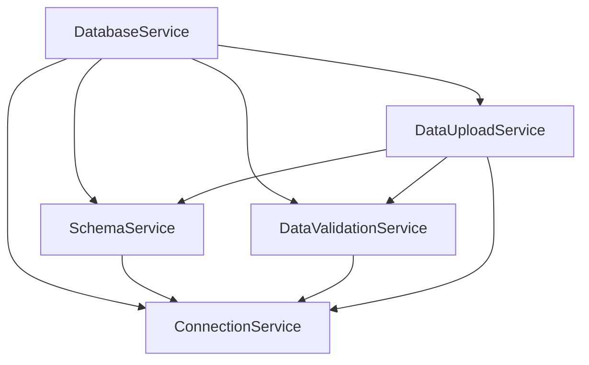
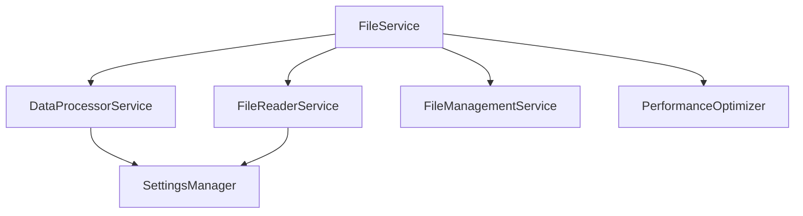

# Architecture Documentation - PIPELINE_SQLSERVER

เอกสารนี้อธิบายสถาปัตยกรรมของระบบ PIPELINE_SQLSERVER แบบ Service-Oriented Architecture (SOA) ที่ได้รับการจัดระเบียบใหม่

## 🏗️ ภาพรวมสถาปัตยกรรม

### High-Level Architecture

```
┌───────────────────────────────────────────────────────────┐
│                    PIPELINE_SQLSERVER                     │
├───────────────────────────────────────────────────────────┤
│                     UI Layer (tkinter)                    │
├───────────────────────────────────────────────────────────┤
│                 Orchestrator Services                     │
│  ┌─────────────────┐        ┌─────────────────┐           │
│  │   FileService   │        │ DatabaseService │           │
│  │  (Orchestrator) │        │  (Orchestrator) │           │
│  └─────────────────┘        └─────────────────┘           │
├───────────────────────────────────────────────────────────┤
│                    Modular Services                       │
│  ┌─────────────────┐        ┌─────────────────┐           │
│  │  File Services  │        │Database Services│           │
│  │                 │        │                 │           │
│  │ • FileReader    │        │ • Connection    │           │
│  │ • DataProcessor │        │ • Schema        │           │
│  │ • FileManager   │        │ • Validation    │           │
│  └─────────────────┘        │ • Upload        │           │
│                             └─────────────────┘           │
├───────────────────────────────────────────────────────────┤
│                   Configuration Layer                     │
│           ┌─────────────┐   ┌─────────────┐               │
│           │   Settings  │   │  Database   │               │
│           │   Manager   │   │   Config    │               │
│           └─────────────┘   └─────────────┘               │
├───────────────────────────────────────────────────────────┤
│                    Infrastructure                         │
│      ┌──────────┐  ┌──────────┐  ┌──────────┐             │
│      │   Files  │  │   SQL    │  │  Config  │             │
│      │  System  │  │  Server  │  │  Files   │             │
│      └──────────┘  └──────────┘  └──────────┘             │
└───────────────────────────────────────────────────────────┘
```

## 🎯 Design Principles

### 1. **Service-Oriented Architecture (SOA)**
- แยกการทำงานเป็น services ที่มีหน้าที่ชัดเจน
- สามารถใช้งานแยกหรือรวมกันได้
- Loose coupling ระหว่าง services

### 2. **Orchestrator Pattern**
- Main services (`FileService`, `DatabaseService`) ทำหน้าที่เป็น orchestrator
- Coordinate การทำงานของ modular services
- รักษา backward compatibility

### 3. **Single Responsibility Principle**
- แต่ละ modular service มีหน้าที่เดียวที่ชัดเจน
- ง่ายต่อการทดสอบและบำรุงรักษา

### 4. **Dependency Injection**
- Services รับ dependencies ผ่าน constructor
- ทำให้ทดสอบและ mock ได้ง่าย

### 5. **Configuration-Driven**
- การตั้งค่าแยกออกจาก business logic
- สามารถปรับเปลี่ยนพฤติกรรมได้ผ่าน configuration

## 📦 Service Layers

### Layer 1: UI Layer
```
ui/
├── main_window.py           # Main GUI application
├── login_window.py          # Database configuration
├── loading_dialog.py        # Progress dialogs
├── components/              # Reusable UI components
├── handlers/                # Event handlers
└── tabs/                    # UI tabs
```

**Responsibilities:**
- User interaction
- Event handling
- Progress indication
- Error display

### Layer 2: Orchestrator Services
```
services/
├── file_service.py          # File operations orchestrator
└── database_service.py      # Database operations orchestrator
```

**Responsibilities:**
- Coordinate modular services
- Provide high-level APIs
- Maintain backward compatibility
- Handle complex workflows

### Layer 3: Modular Services
```
services/
├── database/
│   ├── connection_service.py    # Database connections
│   ├── schema_service.py        # Schema management
│   ├── data_validation_service.py # Data validation
│   └── data_upload_service.py   # Data upload
└── file/
    ├── file_reader_service.py   # File reading
    ├── data_processor_service.py # Data processing
    └── file_management_service.py # File management
```

**Responsibilities:**
- Specific domain operations
- Reusable components
- Fine-grained control
- Single responsibility

### Layer 4: Configuration Layer
```
config/
├── settings.py              # Settings management
├── database.py              # Database configuration
└── *.json                   # Configuration files
```

**Responsibilities:**
- Configuration management
- Settings persistence
- Environment-specific settings

### Layer 5: Infrastructure Layer
- File system operations
- Database connections
- External services

## 🔄 Data Flow

### File Processing Flow
```
1. User selects file(s) → UI Layer
2. FileService.read_excel_file() → Orchestrator
3. FileReaderService.read_file() → Modular Service
4. DataProcessorService.validate() → Modular Service
5. DatabaseService.upload_data() → Orchestrator
6. DataUploadService.upload() → Modular Service
7. FileManagementService.move() → Modular Service
8. Result → UI Layer
```

### Database Operations Flow
```
1. Connection request → DatabaseService
2. ConnectionService.check_connection() → Modular Service
3. SchemaService.ensure_schemas() → Modular Service
4. DataValidationService.validate() → Modular Service
5. DataUploadService.upload() → Modular Service
6. Result → Orchestrator → UI
```

## 🧩 Service Dependencies

### Database Services Dependency Graph


### File Services Dependency Graph


## 📋 Service Contracts

### ConnectionService Interface
```python
class ConnectionService:
    def check_connection(self, show_warning: bool = True) -> Tuple[bool, str]
    def test_connection(self, config: Dict[str, Any]) -> bool
    def update_config(self, **kwargs) -> None
    def get_engine(self) -> Engine
```

### FileReaderService Interface
```python
class FileReaderService:
    def find_data_files(self) -> List[str]
    def detect_file_type(self, file_path: str) -> str
    def read_file_basic(self, file_path: str) -> Tuple[bool, DataFrame]
    def get_column_name_mapping(self, file_type: str) -> Dict[str, str]
```

### DataProcessorService Interface
```python
class DataProcessorService:
    def validate_columns(self, df: DataFrame, logic_type: str) -> Tuple[bool, str]
    def comprehensive_data_validation(self, df: DataFrame, logic_type: str) -> Dict
    def apply_dtypes(self, df: DataFrame, file_type: str) -> DataFrame
    def clean_numeric_columns(self, df: DataFrame, file_type: str) -> DataFrame
```

## 🔐 Security Architecture

### Authentication & Authorization
- Database authentication ผ่าน SQL Server (Windows/SQL Auth)
- Permission checking ผ่าน `PermissionCheckerService`
- No sensitive data in logs

### Data Security
- Connection strings encrypted in configuration
- Secure handling of database credentials
- SQL injection prevention ผ่าน parameterized queries

### File Security
- File path validation
- Safe file operations
- Temporary file cleanup

## ⚡ Performance Architecture

### Memory Management
- Chunked processing สำหรับไฟล์ขนาดใหญ่
- Memory optimization ผ่าน `PerformanceOptimizer`
- Garbage collection management

### Database Performance
- Staging table approach สำหรับ data validation
- Bulk insert operations
- Connection pooling (SQLAlchemy)

### Caching Strategy
- Settings caching ใน memory
- Thread-safe caching mechanisms
- Cache invalidation strategies

## 🧪 Testing Architecture

### Unit Testing
- แต่ละ modular service ทดสอบแยกกัน
- Mock dependencies
- Isolated test environments

### Integration Testing
- Orchestrator services testing
- End-to-end workflows
- Database integration tests

### Testing Tools
```
pytest                   # Test framework
pytest-mock             # Mocking
pytest-cov              # Coverage reporting
```

## 📊 Monitoring & Logging

### Logging Architecture
```
Logger Hierarchy:
├── services.database
│   ├── services.database.connection
│   ├── services.database.schema
│   ├── services.database.validation
│   └── services.database.upload
└── services.file
    ├── services.file.reader
    ├── services.file.processor
    └── services.file.management
```

### Error Handling
- Centralized error messages ใน `constants.py`
- Structured exception handling
- User-friendly error reporting

## 🔮 Extensibility Points

### Adding New File Types
1. Extend `FileReaderService` สำหรับ file format ใหม่
2. เพิ่ม configuration ใน settings
3. Update UI components

### Adding New Database Operations
1. สร้าง service ใหม่ใน `services/database/`
2. Integrate กับ `DatabaseService` orchestrator
3. Add configuration options

### Adding New Validation Rules
1. Extend `DataValidationService`
2. เพิ่ม validation methods
3. Update configuration schema

## 📝 Best Practices

### Service Development
1. Follow single responsibility principle
2. Use dependency injection
3. Implement proper error handling
4. Add comprehensive logging
5. Write unit tests

### Configuration Management
1. Use centralized configuration
2. Validate configuration on startup
3. Provide sensible defaults
4. Document all configuration options

### Database Operations
1. Use staging tables for validation
2. Implement proper transaction handling
3. Handle connection failures gracefully
4. Use parameterized queries

## 🔄 Migration Strategies

### From Monolithic to Modular
1. Maintain orchestrator services for backward compatibility
2. Gradually extract functionality to modular services
3. Update clients to use new APIs when ready
4. Deprecate old APIs gradually

### Database Schema Changes
1. Use migration scripts
2. Backward compatibility during transition
3. Version configuration schemas
4. Test migrations thoroughly

---

**หมายเหตุ:** สถาปัตยกรรมนี้ออกแบบเพื่อให้มีความยืดหยุ่นสูง รองรับการขยายระบบ และง่ายต่อการบำรุงรักษา โดยยังคงความเรียบง่ายในการใช้งาน