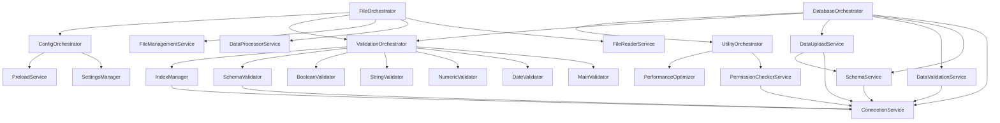
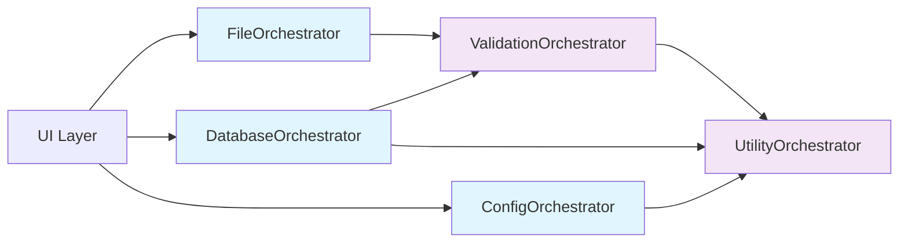

# Architecture Documentation - PIPELINE_SQLSERVER

เอกสารนี้อธิบายสถาปัตยกรรมของระบบ PIPELINE_SQLSERVER แบบ Clean Service-Oriented Architecture (SOA) ที่ได้รับการปรับปรุงใหม่ล่าสุด

## 🏗️ ภาพรวมสถาปัตยกรรม

### High-Level Architecture

```
┌───────────────────────────────────────────────────────────┐
│                 PIPELINE_SQLSERVER (v2.0)                 │
│                  Clean Architecture                       │
├───────────────────────────────────────────────────────────┤
│                     UI Layer (tkinter)                    │
│    Components • Handlers • Tabs • Windows • Dialogs      │
├───────────────────────────────────────────────────────────┤
│                  Orchestrator Services                    │
│  ┌──────────────┐ ┌─────────────┐ ┌─────────────┐         │
│  │     File     │ │  Database   │ │   Config    │         │
│  │ Orchestrator │ │Orchestrator │ │Orchestrator │         │
│  └──────────────┘ └─────────────┘ └─────────────┘         │
│  ┌──────────────┐ ┌─────────────┐                         │
│  │ Validation   │ │   Utility   │                         │
│  │ Orchestrator │ │Orchestrator │                         │
│  └──────────────┘ └─────────────┘                         │
├───────────────────────────────────────────────────────────┤
│                    Modular Services                       │
│  ┌─────────────┐ ┌─────────────┐ ┌─────────────┐          │
│  │    File     │ │  Database   │ │  Utilities  │          │
│  │  Services   │ │  Services   │ │  Services   │          │
│  │ • Reader    │ │ • Connection│ │ • Permission│          │
│  │ • Processor │ │ • Schema    │ │ • Preload   │          │
│  │ • Manager   │ │ • Validation│ │             │          │
│  └─────────────┘ │ • Upload    │ └─────────────┘          │
│                  │ • Validators│                          │
│                  └─────────────┘                          │
├───────────────────────────────────────────────────────────┤
│                 Configuration & Utils                     │
│           ┌─────────────┐   ┌─────────────┐               │
│           │   Config    │   │    Utils    │               │
│           │ • Database  │   │ • Helpers   │               │
│           │ • Settings  │   │ • Logger    │               │
│           └─────────────┘   │ • Validators│               │
│                             └─────────────┘               │
├───────────────────────────────────────────────────────────┤
│                    Infrastructure                         │
│      ┌──────────┐  ┌──────────┐  ┌──────────┐             │
│      │   Files  │  │   SQL    │  │  Config  │             │
│      │  System  │  │  Server  │  │  Files   │             │
│      └──────────┘  └──────────┘  └──────────┘             │
└───────────────────────────────────────────────────────────┘
```

## 🎯 Design Principles

### 1. **Clean Service-Oriented Architecture (SOA)**
- แยกการทำงานเป็น services ที่มีหน้าที่ชัดเจน
- สามารถใช้งานแยกหรือรวมกันได้
- Loose coupling ระหว่าง services
- ไม่มี backward compatibility ที่ซับซ้อน

### 2. **Orchestrator Pattern**
- Orchestrator services ทำหน้าที่ประสานงาน modular services
- แต่ละ orchestrator รับผิดชอบ domain เฉพาะ
- Standard naming convention: `*Orchestrator`

### 3. **Single Responsibility Principle**
- แต่ละ modular service มีหน้าที่เดียวที่ชัดเจน
- แต่ละ orchestrator จัดการ domain เฉพาะ
- ง่ายต่อการทดสอบและบำรุงรักษา

### 4. **Dependency Injection**
- Services รับ dependencies ผ่าน constructor
- ทำให้ทดสอบและ mock ได้ง่าย
- Clear separation of concerns

### 5. **Configuration-Driven**
- การตั้งค่าแยกออกจาก business logic
- Centralized configuration management
- Environment-specific configurations

### 6. **Consistent Structure**
- Standard folder organization
- Consistent naming conventions
- Clear import paths

## 📦 Service Layers

### Layer 1: UI Layer
```
ui/
├── main_window.py           # Main GUI application
├── login_window.py          # Database configuration
├── loading_dialog.py        # Progress dialogs
├── components/              # Reusable UI components
├── handlers/                # Event handlers
└── tabs/                    # UI tabs
```

**Responsibilities:**
- User interaction
- Event handling
- Progress indication
- Error display

### Layer 2: Orchestrator Services
```
services/orchestrators/
├── file_orchestrator.py        # File operations orchestrator
├── database_orchestrator.py    # Database operations orchestrator
├── config_orchestrator.py      # Configuration orchestrator
├── validation_orchestrator.py  # Validation orchestrator
└── utility_orchestrator.py     # Utility services orchestrator
```

**Responsibilities:**
- Coordinate modular services
- Provide high-level APIs
- Handle complex workflows
- Centralize cross-cutting concerns

### Layer 3: Modular Services
```
services/
├── database/
│   ├── connection_service.py       # Database connections
│   ├── schema_service.py           # Schema management
│   ├── data_validation_service.py  # Data validation
│   ├── data_upload_service.py      # Data upload
│   └── validation/                 # Validation modules
│       ├── main_validator.py       # Main validation logic
│       ├── date_validator.py       # Date validation
│       ├── numeric_validator.py    # Numeric validation
│       ├── string_validator.py     # String validation
│       ├── boolean_validator.py    # Boolean validation
│       ├── schema_validator.py     # Schema validation
│       └── index_manager.py        # Index management
├── file/
│   ├── file_reader_service.py      # File reading
│   ├── data_processor_service.py   # Data processing
│   └── file_management_service.py  # File management
└── utilities/
    ├── permission_checker_service.py # Permission checking
    └── preload_service.py          # Data preloading
```

**Responsibilities:**
- Specific domain operations
- Reusable components
- Fine-grained control
- Single responsibility

### Layer 4: Configuration & Utilities
```
config/
├── __init__.py
├── settings.py              # Settings management
├── database.py              # Database configuration
└── sql_config.json          # Configuration files

utils/
├── __init__.py
├── helpers.py               # Helper functions
├── logger.py                # Logging utilities
└── validators.py            # Validation functions
```

**Responsibilities:**
- Configuration management
- Settings persistence
- Utility functions
- Logging and validation
- Helper methods

### Layer 5: Infrastructure Layer
- File system operations
- Database connections
- External services
- Third-party integrations

## 🔄 Data Flow (Updated)

### File Processing Flow
```
1. User selects file(s) → UI Layer
2. FileOrchestrator.read_excel_file() → Orchestrator
3. FileReaderService.read_file() → Modular Service
4. ValidationOrchestrator.validate() → Orchestrator
5. DatabaseOrchestrator.upload_data() → Orchestrator
6. DataUploadService.upload() → Modular Service
7. FileManagementService.move() → Modular Service
8. Result → UI Layer
```

### Database Operations Flow
```
1. Connection request → DatabaseOrchestrator
2. ConnectionService.check_connection() → Modular Service
3. SchemaService.ensure_schemas() → Modular Service
4. ValidationOrchestrator.validate() → Orchestrator
5. DataUploadService.upload() → Modular Service
6. Result → Orchestrator → UI
```

### Configuration Flow
```
1. App startup → ConfigOrchestrator
2. SettingsManager.load() → Modular Service
3. PreloadService.load() → Utility Service
4. Configuration ready → Application
```

### Validation Flow
```
1. Data validation request → ValidationOrchestrator
2. MainValidator.validate() → Modular Service
3. SpecificValidators.validate() → Modular Services
4. Results aggregation → Orchestrator
5. Validation results → Caller
```

## 🧩 Service Dependencies

### Complete Orchestrator Dependencies (v2.0)


### Clean Integration Flow (v2.0)


## 📋 Service Contracts

### Orchestrator Service Interfaces

#### ConfigOrchestrator Interface
```python
class ConfigOrchestrator:
    def initialize_application_config(self, progress_callback=None) -> Tuple[bool, str, Dict]
    def update_database_config(self, **config_params) -> Tuple[bool, str]
    def update_app_settings(self, **settings_params) -> Tuple[bool, str]
    def validate_config(self) -> Tuple[bool, str, List[str]]
    def get_complete_config(self) -> Dict[str, Any]
```

#### ValidationOrchestrator Interface
```python
class ValidationOrchestrator:
    def comprehensive_validation(self, df: DataFrame, logic_type: str, schema_name: str) -> Dict
    def quick_validate(self, df: DataFrame, logic_type: str) -> Tuple[bool, str]
    def validate_before_upload(self, df: DataFrame, logic_type: str, schema_name: str) -> Tuple[bool, str, Dict]
    def clean_data(self, df: DataFrame, logic_type: str) -> DataFrame
```

#### UtilityOrchestrator Interface
```python
class UtilityOrchestrator:
    def comprehensive_system_check(self, schema_name: str) -> Dict[str, Any]
    def check_database_permissions(self, schema_name: str) -> Dict[str, Any]
    def check_system_performance(self) -> Dict[str, Any]
    def optimize_dataframe_memory(self, df: DataFrame) -> Tuple[DataFrame, Dict]
    def setup_application_logging(self, log_level: str) -> Tuple[bool, str]
```

#### FileOrchestrator Interface (Updated)
```python
class FileOrchestrator:
    def read_excel_file(self, file_path: str, logic_type: str) -> Tuple[bool, DataFrame]
    def find_data_files(self) -> List[str]
    def detect_file_type(self, file_path: str) -> str
    def validate_file_before_processing(self, file_path: str, logic_type: str) -> Dict
    def move_uploaded_files(self, files: List[str], types: List[str]) -> Tuple[bool, str]
```

#### DatabaseOrchestrator Interface (Updated)
```python
class DatabaseOrchestrator:
    def check_connection(self, show_warning: bool = True) -> Tuple[bool, str]
    def upload_dataframe(self, df: DataFrame, logic_type: str) -> Tuple[bool, str]
    def ensure_schemas_exist(self) -> Tuple[bool, str]
    def validate_data_before_upload(self, df: DataFrame, logic_type: str) -> Dict
    def check_permissions(self, schema_name: str = 'bronze') -> Dict
```

### Modular Service Interfaces

#### ConnectionService Interface
```python
class ConnectionService:
    def check_connection(self, show_warning: bool = True) -> Tuple[bool, str]
    def test_connection(self, config: Dict[str, Any]) -> bool
    def update_config(self, **kwargs) -> None
    def get_engine(self) -> Engine
```

#### FileReaderService Interface
```python
class FileReaderService:
    def find_data_files(self) -> List[str]
    def detect_file_type(self, file_path: str) -> str
    def read_file_basic(self, file_path: str) -> Tuple[bool, DataFrame]
    def get_column_name_mapping(self, file_type: str) -> Dict[str, str]
```

## 🔐 Security Architecture

### Authentication & Authorization
- Database authentication ผ่าน SQL Server (Windows/SQL Auth)
- Permission checking ผ่าน `PermissionCheckerService`
- No sensitive data in logs

### Data Security
- Connection strings encrypted in configuration
- Secure handling of database credentials
- SQL injection prevention ผ่าน parameterized queries

### File Security
- File path validation
- Safe file operations
- Temporary file cleanup

## ⚡ Performance Architecture

### Memory Management
- Chunked processing สำหรับไฟล์ขนาดใหญ่
- Memory optimization ผ่าน `PerformanceOptimizer`
- Garbage collection management

### Database Performance
- Staging table approach สำหรับ data validation
- Bulk insert operations
- Connection pooling (SQLAlchemy)

### Caching Strategy
- Settings caching ใน memory
- Thread-safe caching mechanisms
- Cache invalidation strategies

## 🧪 Testing Architecture

### Unit Testing
- แต่ละ modular service ทดสอบแยกกัน
- Mock dependencies
- Isolated test environments

### Integration Testing
- Orchestrator services testing
- End-to-end workflows
- Database integration tests

### Testing Tools
```
pytest                   # Test framework
pytest-mock             # Mocking
pytest-cov              # Coverage reporting
```

## 📊 Monitoring & Logging

### Logging Architecture
```
Logger Hierarchy:
├── services.database
│   ├── services.database.connection
│   ├── services.database.schema
│   ├── services.database.validation
│   └── services.database.upload
└── services.file
    ├── services.file.reader
    ├── services.file.processor
    └── services.file.management
```

### Error Handling
- Centralized error messages ใน `constants.py`
- Structured exception handling
- User-friendly error reporting

## 🔮 Extensibility Points

### Adding New File Types
1. **Extend FileReaderService** - Add new file format support
2. **Update ConfigOrchestrator** - Add configuration for new type
3. **Modify FileOrchestrator** - Register new type detection
4. **Update UI components** - Add support in file selection
5. **Add validation rules** - Include in ValidationOrchestrator if needed

### Adding New Database Operations
1. **Create modular service** - Add to `services/database/`
2. **Integrate with DatabaseOrchestrator** - Add coordination logic
3. **Update ConfigOrchestrator** - Add any configuration options
4. **Update service contracts** - Maintain interface consistency
5. **Add tests** - Unit and integration tests

### Adding New Validation Rules
1. **Create validator** - Add to `services/database/validation/`
2. **Register with ValidationOrchestrator** - Include in validation flow
3. **Update configuration** - Add validation settings
4. **Add to comprehensive workflow** - Ensure proper integration
5. **Document validation rules** - Clear documentation

### Adding New Utility Services
1. **Create utility service** - Add to `services/utilities/`
2. **Integrate with UtilityOrchestrator** - Add coordination logic
3. **Add system check capabilities** - Include in health checks
4. **Update service interfaces** - Maintain consistency
5. **Add comprehensive tests** - Ensure reliability

### Adding New Orchestrators
1. **Create orchestrator** - Add to `services/orchestrators/`
2. **Follow naming convention** - Use `*Orchestrator` pattern
3. **Implement standard interface** - Consistent method signatures
4. **Add to services/__init__.py** - Optional, if needed for imports
5. **Update ARCHITECTURE.md** - Document new orchestrator

## 📝 Best Practices (v2.0)

### Orchestrator Development
1. **Single Domain Responsibility** - Each orchestrator handles one domain
2. **Dependency Injection** - Accept modular services via constructor
3. **Error Aggregation** - Collect and format errors from multiple services
4. **Logging Coordination** - Coordinate logging across modular services
5. **Interface Consistency** - Maintain consistent method signatures

### Modular Service Development
1. **Pure Functions When Possible** - Avoid side effects where feasible
2. **Clear Input/Output** - Well-defined parameter and return types
3. **Single Responsibility** - One clear purpose per service
4. **Testable Design** - Easy to mock and unit test
5. **No Direct UI Interaction** - Services should not know about UI

### Folder Organization
1. **services/orchestrators/** - High-level coordination services
2. **services/utilities/** - Cross-cutting utility services
3. **services/database/** - Database-specific modular services
4. **services/file/** - File-specific modular services
5. **No backward compatibility files** - Clean structure only

### Naming Conventions
1. **Orchestrators** - `*Orchestrator` (e.g., `FileOrchestrator`)
2. **Services** - `*Service` (e.g., `ConnectionService`)
3. **Validators** - `*Validator` (e.g., `DateValidator`)
4. **Managers** - `*Manager` (e.g., `IndexManager`)
5. **Handlers** - `*Handler` (e.g., `FileHandler`)

### Import Guidelines
```python
# Correct - Use full orchestrator paths
from services.orchestrators.file_orchestrator import FileOrchestrator
from services.orchestrators.database_orchestrator import DatabaseOrchestrator

# Correct - Use specific service paths
from services.utilities.permission_checker_service import PermissionCheckerService
from services.database.connection_service import ConnectionService

# Avoid - No backward compatibility imports
# from services.file_service import FileService  # DON'T USE
```

### Configuration Management
1. **Centralized through ConfigOrchestrator** - Single point of configuration
2. **Environment-specific settings** - Support dev/prod configurations
3. **Validation on startup** - Fail fast with clear error messages
4. **Default value provision** - Sensible defaults for all settings
5. **Documentation** - Document all configuration options

### Database Operations
1. **Use orchestrators for coordination** - Don't call services directly
2. **Staging tables for validation** - Validate before inserting to main tables
3. **Transaction handling** - Proper rollback on failures
4. **Connection pooling** - Efficient connection management
5. **Parameterized queries** - Prevent SQL injection

### Testing Strategy
1. **Unit tests for modular services** - Test services in isolation
2. **Integration tests for orchestrators** - Test service coordination
3. **Mock external dependencies** - Database, file system, etc.
4. **Structure consistency tests** - Verify folder organization
5. **Import validation tests** - Ensure no backward compatibility usage

## 🔄 Migration Strategies

### From Monolithic to Modular
1. Maintain orchestrator services for backward compatibility
2. Gradually extract functionality to modular services
3. Update clients to use new APIs when ready
4. Deprecate old APIs gradually

### Database Schema Changes
1. Use migration scripts
2. Backward compatibility during transition
3. Version configuration schemas
4. Test migrations thoroughly

## 🚀 Recent Changes & Improvements

### Version 2.0 - Clean Architecture Refactor

#### **Major Changes:**
1. **Removed Backward Compatibility**
   - Eliminated complex alias files
   - Cleaner codebase structure
   - Reduced maintenance overhead

2. **Standardized Naming Convention**
   - `*Service` → `*Orchestrator` for orchestrators
   - Consistent folder organization
   - Clear separation of concerns

3. **Improved Structure Organization**
   - `services/orchestrators/` - High-level coordination
   - `services/utilities/` - Utility services
   - `services/database/` - Database-specific services
   - `services/file/` - File-specific services

4. **Enhanced Service Dependencies**
   - Clearer dependency graph
   - Reduced circular dependencies
   - Better testability

#### **Migration from v1.x:**
```python
# Old (v1.x)
from services.file_service import FileService
from services.database_service import DatabaseService

# New (v2.0)
from services.orchestrators.file_orchestrator import FileOrchestrator
from services.orchestrators.database_orchestrator import DatabaseOrchestrator
```

#### **Benefits:**
- **Cleaner codebase** - No backward compatibility bloat
- **Better maintainability** - Consistent patterns throughout
- **Improved testability** - Clear dependency injection
- **Enhanced scalability** - Easy to add new orchestrators
- **Better documentation** - Self-documenting structure

### Testing Coverage
- ✅ Structure Consistency Tests
- ✅ Orchestrator Service Tests
- ✅ Modular Service Tests
- ✅ UI Component Tests
- ✅ Utility Module Tests
- ✅ Integration Tests

---

**หมายเหตุ:** สถาปัตยกรรม v2.0 นี้ออกแบบเพื่อให้มีความยืดหยุ่นสูง รองรับการขยายระบบ และง่ายต่อการบำรุงรักษา โดยไม่มีความซับซ้อนจาก backward compatibility และมีมาตรฐานที่สอดคล้องกันทั้งระบบ