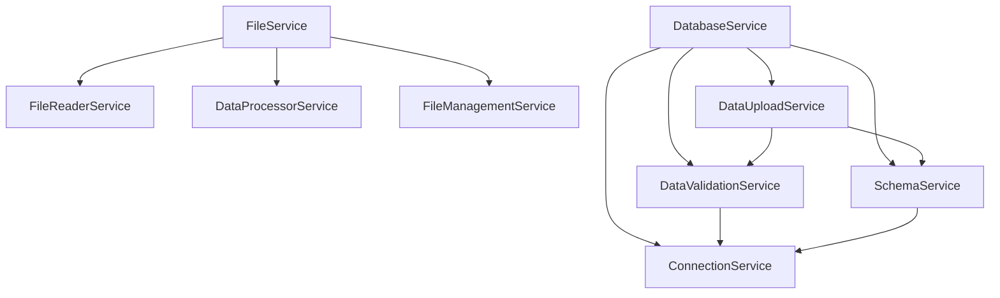

# Services Module - PIPELINE_SQLSERVER

โฟลเดอร์ `services/` ได้รับการจัดระเบียบใหม่แบบ **Service-Oriented Architecture (SOA)** เพื่อแยกหน้าที่ให้ชัดเจน ง่ายต่อการบำรุงรักษา และสามารถใช้งานแยกหรือรวมกันได้

## 🏗️ โครงสร้างใหม่แบบ Modular

### 📊 Orchestrator Services (Main Services)

#### 🗄️ DatabaseService (`database_service.py`)
**หน้าที่:** Orchestrator สำหรับการจัดการฐานข้อมูล SQL Server
- ประสานงานระหว่าง modular database services
- รักษา backward compatibility กับ API เดิม
- จัดการ connection, schema, validation, และ upload แบบครบวงจร

#### 📁 FileService (`file_service.py`)
**หน้าที่:** Orchestrator สำหรับการจัดการไฟล์
- ประสานงานระหว่าง modular file services
- รักษา backward compatibility กับ API เดิม
- จัดการการอ่าน ประมวลผล และจัดการไฟล์แบบครบวงจร

### 🧩 Modular Database Services (`database/`)

#### 🔌 ConnectionService (`database/connection_service.py`)
**หน้าที่:** จัดการการเชื่อมต่อฐานข้อมูล
- ทดสอบและตรวจสอบการเชื่อมต่อ
- อัปเดตการตั้งค่าการเชื่อมต่อ
- จัดการ SQLAlchemy engine

#### 🏗️ SchemaService (`database/schema_service.py`)
**หน้าที่:** จัดการ schema และ table structures
- สร้าง schema ใหม่หากไม่มีอยู่
- ตรวจสอบ schema ที่มีอยู่
- จัดการโครงสร้างตาราง

#### ✅ DataValidationService (`database/data_validation_service.py`)
**หน้าที่:** ตรวจสอบข้อมูลใน staging tables
- ตรวจสอบความถูกต้องของข้อมูลด้วย SQL queries
- สร้างรายงานการตรวจสอบ
- ตรวจจับ schema mismatches

#### ⬆️ DataUploadService (`database/data_upload_service.py`)
**หน้าที่:** อัปโหลดข้อมูลไปฐานข้อมูล
- สร้างและจัดการ staging tables
- แปลงข้อมูลตาม data types ที่กำหนด
- จัดการการ upload แบบ chunked สำหรับไฟล์ขนาดใหญ่

### 🗂️ Modular File Services (`file/`)

#### 📖 FileReaderService (`file/file_reader_service.py`)
**หน้าที่:** การอ่านและตรวจจับไฟล์
- ค้นหาไฟล์ Excel/CSV
- อ่านไฟล์แบบพื้นฐาน
- ตรวจจับประเภทไฟล์อัตโนมัติ
- จัดการ column mapping
- ตรวจสอบโครงสร้างไฟล์

#### ⚙️ DataProcessorService (`file/data_processor_service.py`)
**หน้าที่:** การประมวลผลและตรวจสอบข้อมูล
- ตรวจสอบความถูกต้องของข้อมูล (validation)
- แปลงประเภทข้อมูล (data type conversion)
- ทำความสะอาดข้อมูล (data cleaning)
- ตัดข้อมูลที่ยาวเกิน (string truncation)
- สร้างรายงานการตรวจสอบ

#### 📂 FileManagementService (`file/file_management_service.py`)
**หน้าที่:** การจัดการไฟล์
- ย้ายไฟล์ที่ประมวลผลแล้ว
- จัดระเบียบโฟลเดอร์
- จัดการการตั้งค่า

### 🔐 Supporting Services

#### 🛡️ PermissionCheckerService (`permission_checker_service.py`)
**หน้าที่:** ตรวจสอบสิทธิ์ของผู้ใช้/connection บน SQL Server
- ตรวจสิทธิ์ CRUD ขั้นพื้นฐานบน schema เป้าหมาย
- สรุปสิทธิ์ที่ขาดและคำแนะนำการตั้งค่า

#### ⚡ PreloadService (`preload_service.py`)
**หน้าที่:** โหลดการตั้งค่าที่จำเป็นล่วงหน้า
- โหลด column mapping และ dtype mapping จาก `config/`
- คืนค่าโครงสร้างที่พร้อมใช้ใน UI/Service อื่นๆ

## 🔧 การใช้งาน

### Basic Usage (แบบเดิม - ยังใช้ได้)
```python
from services import FileService, DatabaseService

# สร้าง orchestrator services
file_service = FileService(log_callback=print)
db_service = DatabaseService()

# อ่านและประมวลผลไฟล์
success, df = file_service.read_excel_file("data.xlsx", "sales_data")

# อัปโหลดไปฐานข้อมูล
if success:
    dtypes = file_service.get_required_dtypes("sales_data")
    result = db_service.upload_data(df, "sales_data", dtypes)
```

### Modular Usage (ใช้ services แยก)
```python
from services.database import ConnectionService, DataUploadService
from services.file import FileReaderService, DataProcessorService

# Database services
connection_service = ConnectionService()
upload_service = DataUploadService(connection_service.get_engine(), schema_service, validation_service)

# File services
reader = FileReaderService()
processor = DataProcessorService()

# ใช้งานแยกตามต้องการ
success, df = reader.read_file_basic("data.xlsx")
validation = processor.comprehensive_data_validation(df, "sales_data")
```

### Mixed Usage (ผสมระหว่าง orchestrator และ modular)
```python
from services import DatabaseService
from services.file import FileReaderService

# ใช้ modular สำหรับการอ่านไฟล์
reader = FileReaderService()
success, df = reader.read_file_basic("data.xlsx")

# ใช้ orchestrator สำหรับ database
db_service = DatabaseService()
dtypes = db_service.get_required_dtypes("sales_data")
result = db_service.upload_data(df, "sales_data", dtypes)
```

## 📦 Import Patterns

### Orchestrator Services
```python
# Main services (recommended for most use cases)
from services import FileService, DatabaseService

# Individual orchestrators
from services.file_service import FileService
from services.database_service import DatabaseService
```

### Modular Services
```python
# Database modules
from services.database import (
    ConnectionService,
    SchemaService,
    DataValidationService,
    DataUploadService
)

# File modules
from services.file import (
    FileReaderService,
    DataProcessorService,
    FileManagementService
)

# Supporting services
from services.permission_checker_service import PermissionCheckerService
from services.preload_service import PreloadService
```

## 🔄 Migration Guide

### ✅ สิ่งที่ยังใช้ได้ (Backward Compatible)
- `FileService` - ยังทำงานเหมือนเดิมทุกประการ
- `DatabaseService` - ยังทำงานเหมือนเดิมทุกประการ
- การ import แบบเดิม: `from services import FileService, DatabaseService`
- Methods หลักทั้งหมดยังใช้ได้
- Parameter signatures เหมือนเดิม

### 🆕 สิ่งที่เพิ่มเข้ามา
- **Modular Services:** สามารถใช้แต่ละ service แยกได้
- **Better separation of concerns:** แต่ละ service มีหน้าที่ชัดเจน
- **เพิ่ม granular control:** สามารถควบคุมในระดับที่ละเอียดขึ้น
- **เพิ่ม services ใหม่:**
  - Database: `ConnectionService`, `SchemaService`, `DataValidationService`, `DataUploadService`
  - File: แยก `FileReaderService`, `DataProcessorService`, `FileManagementService` ออกมาให้ใช้แยกได้

### 🗑️ สิ่งที่ Deprecated
- ไม่มี - ระบบรักษา backward compatibility เต็มรูปแบบ

## 🎯 ประโยชน์ของ Modular Architecture

### 1. **📦 Single Responsibility Principle**
แต่ละ service มีหน้าที่เดียวและชัดเจน

### 2. **🔧 Easier Maintenance**
แก้ไขหรือปรับปรุงส่วนใดส่วนหนึ่งได้โดยไม่กระทบส่วนอื่น

### 3. **🧪 Better Testability**
ทดสอบแต่ละ service ได้แยกกัน มี mock dependencies ได้ง่าย

### 4. **🔄 Reusability**
สามารถใช้ service ใดๆ ในบริบทอื่นได้

### 5. **⚡ Performance**
โหลดเฉพาะ services ที่ต้องการ ลดการใช้หน่วยความจำ

### 6. **🔒 Backward Compatibility**
โค้ดเดิมยังใช้ได้ 100%

### 7. **🛠️ AI-Friendly**
AI สามารถทำความเข้าใจและปรับปรุงแต่ละส่วนได้ง่ายขึ้น

## 📊 Service Dependencies



## 🔮 Future Enhancements

1. **Async Support**: เพิ่ม async methods สำหรับ I/O operations
2. **Plugin System**: ระบบ plugin สำหรับขยาย functionality
3. **Message Queue**: รองรับ message queue สำหรับ distributed processing
4. **Health Checks**: monitoring และ health check services
5. **Metrics**: การเก็บ metrics และ performance monitoring

---

**หมายเหตุ:** การจัดระเบียบแบบ modular นี้ทำให้ระบบมีความยืดหยุ่นสูง แต่ยังคงความเรียบง่ายในการใช้งานแบบเดิม ผู้ใช้สามารถเลือกใช้ในระดับที่เหมาะสมกับความต้องการได้